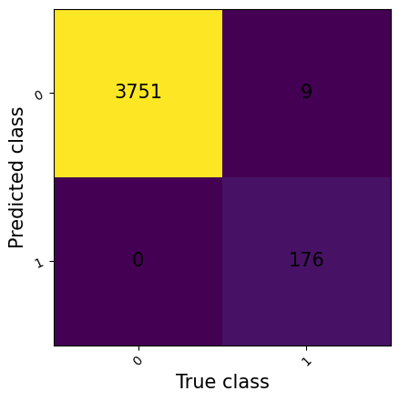
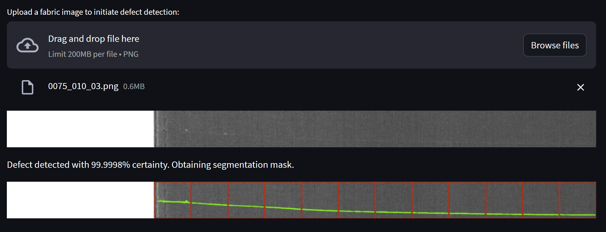

# Fabric Defect Detection
This repository stores code for training and deploying models for detecting defects in the AITEX Fabric Image Dataset. It contains routines to train multiple model versions as well as a Streamlit UI for inference (classification and segmentation).

## Setup
As with any Python project, I strongly recommend making a dedicated environment for this repo, whether with conda or another environment manager. Here are some steps to run from the root directory in order to set up this repo after cloning:

1. Set up and activate a venv:
```
conda create -n fdd python=3.10
conda activate fdd
```

2. Install requirements:
```
pip install -r requirements.txt
```

3. Load the large model file that couldn't be stored here without paying extra to use LFS:
```
python get_models.py
```

4. To start the Streamlit UI for inference, run:
```
streamlit run deploy/app.py
``` 

The notebooks and such should also be runnable now, if interested, either by using an IDE that supports .ipynb files or by running either
```
jupyter notebook
```
or 
```
jupyter lab
```

Enjoy!

## Modeling Approach
I decided to take a hybrid approach with this solution. The core is we are trying to detect defects in images of fabric. Data is collected from the [AITEX Fabric Image Database](https://www.kaggle.com/datasets/nexuswho/aitex-fabric-image-database). This dataset contains 140 defect-free images and 105 images with defects across 12 defect types.

One notable challenge of the dataset is sparsity of information. While there are a reasonable amount of images containing defects, the actual defects make up a small fraction of the pixels present within each image. In other words, defects are a rare event in this dataset. To get around this, I decided to apply binary classification (defect vs. no defect) for patches from each image, after which I trained a UNet architecture to segment the defects themselves from the patches that were found to contain defects.

Light preprocessing was used. After resizing images to (256, 4096), I patched them into 16 different (256, 256) images and applied histogram-based contrast normalization - this helped ensure relative homogeneity from image to image and drastically improved the modeling results.

For classification (binary_patch_classification.ipynb), I trained a relatively small convolutional neural network (CNN) with 4 blocks of 2D Convolutions, ReLU Activations, and 2D Max Pooling. These feature extraction layers were followed by two sets of fully-connected dense layers, and a single-value sigmoid layer on the output. With this approach, I obtained an F1 Score of 0.975 with the following confusion matrix:



For segmentation, I used the Improved UNet architecture (unet_segmentation.ipynb), with some code borrowed from an unrelated [Kaggle competition](https://www.kaggle.com/code/alexj21/pytorch-eda-unet-from-scratch-finetuning). I had code for some smaller UNet architectures that I'd written in the past, but this particular set of code included a more robust UNet implementation, as well as loss functions that were incredibly useful for the training process. Specifically, I used a hybrid loss that balanced between the Focal Tversky Loss and the classic DICE Loss, both often used for segmentation. The Focal loss does well in sparse cases because it prioritizes identifying true positives in an otherwise sparse domain. With this approach, I achieved a mean IOU score of 0.38 for the train dataset and 0.46 for the test dataset. While these scores appear low, the model was a) able to effectively localize most anomalies, and b) it is important to remember that even in patched images, the defect pixels are relatively small and rare, and so even a small handful of stray pixels in prediction can impact the results. With more time, this approach can be improved upon further as well.

Other approaches I attempted included:

1. The use of VAE's for unsupervised anomaly detection (train on normal images and detect anomalies in abnormal images when they're  out of distribution)
2. Object detection using the Faster RCNN architecture
3. Segformer, a transformer used for segmentation
4. A more typical ResNet architecture for multi-class classification

## UI
The Streamlit UI allows an upload of a .png fabric image. This image is processed and each patch is run through the binary classification algorithm. If a defect is detected in any patch, the corresponing patches are run through the segmentation algorithm. The algorithm returns an image with a border around the defective patch in red, and the defect itself highlighted in green, as below. If no defect is detected, only one image is displayed.



## Limitations and Future Work
This work was conducted in a short amount of time (a few days). With more time, I see great promise in the object detection approaches, specifically for identifying the type of defect (as opposed to just segmenting any defect, as with the UNet approach). That being said, from a practically perspective, a manufacturing company is likely first and foremost interested in knowing whether a given fabric sample has any defect, in order to remove them from their line. This approach works quite well for that, but for more robust and localized defect detection, different methods can and should be explored.

I did also notice some mild instability in the training process itself, particularly with the segmentation approach. This could be address by a method like Batch Normalization, but in early experiments, I found this hurt the results too much.

Another limitation of the repo itself: git charges for LFS storage on public repos. That's a bit of a drag, and so my solution was to store a large model file in Google Drive. A more production-ready solution would involve LFS or an S3 bucket. Furthermore, this repo does not contain a CI/CD pipeline, testing, or any of the other fun stuff that I would typically include in a production-ready repo.